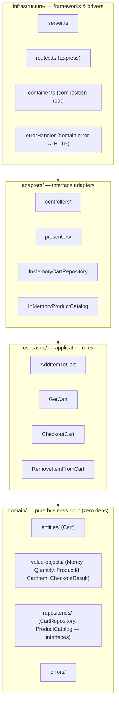
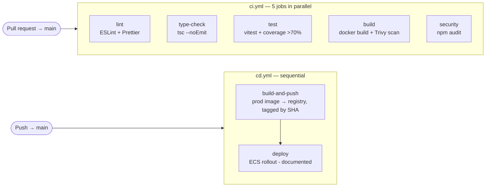
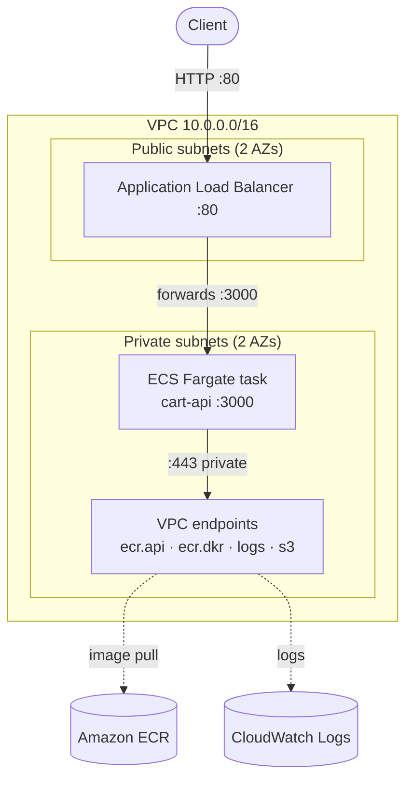
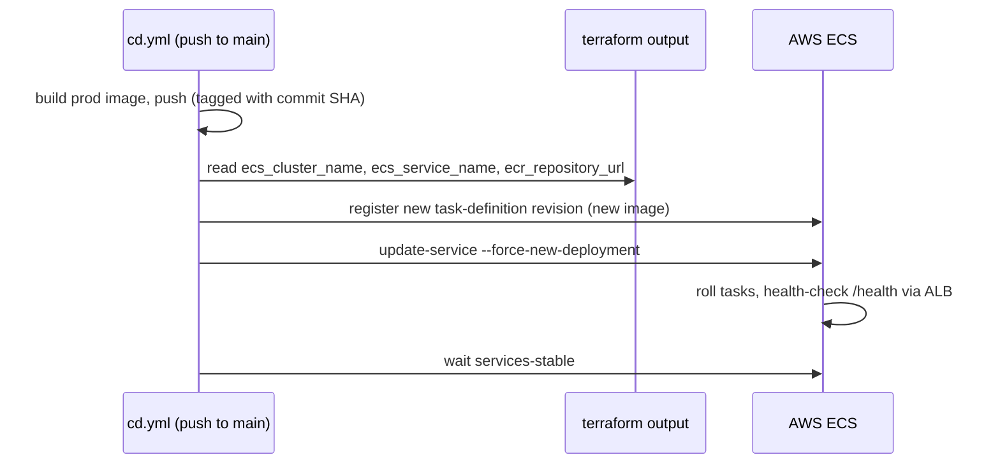

# Shopping Cart REST API

A TypeScript shopping cart REST API built to demonstrate **Clean Architecture**,
**domain-driven design**, and a complete **DevOps** path (Docker, CI/CD, and
Terraform-described infrastructure). The emphasis, in order, is domain modelling →
architecture → design patterns → delivery.

The codebase favours **functional composition with factory functions** over
classes: value objects and entities are immutable `readonly` types, mutations are
pure functions returning new instances, and dependency injection is just function
arguments — no DI container, no mocking framework.

**Tech stack:** Node 20 · TypeScript (strict, no `any`) · Express 5 · Zod
(boundary validation) · pino (structured logging) · Vitest (tests + coverage).

## Documentation map

This README is the hub; each section summarises a topic and links to a deep-dive.

| Topic | Deep-dive |
|-------|-----------|
| Domain model rationale (every decision + rejected alternatives) | [`docs/domain-model.md`](./docs/domain-model.md) |
| Architecture, layers, patterns, request flow, trade-offs | [`docs/architecture.md`](./docs/architecture.md) |
| Docker strategy (three images, multi-stage, sizing) | [`infra/docker/README.md`](./infra/docker/README.md) |
| Terraform infrastructure (network, security, CD alignment) | [`infra/terraform/README.md`](./infra/terraform/README.md) |

---

## Table of contents

1. [Domain Model Design](#1-domain-model-design)
2. [Architecture Overview](#2-architecture-overview)
3. [Design Patterns Implemented](#3-design-patterns-implemented)
4. [Docker Setup](#4-docker-setup)
5. [CI/CD Pipeline](#5-cicd-pipeline)
6. [Infrastructure Design](#6-infrastructure-design)
7. [Local Development](#7-local-development)
8. [API Documentation](#8-api-documentation)
9. [Deployment Strategy](#9-deployment-strategy)
10. [Trade-offs & Improvements](#10-trade-offs--improvements)

---

## 1. Domain Model Design

> Full rationale, including every rejected alternative: [`docs/domain-model.md`](./docs/domain-model.md).

The model centres on a single **Cart** bounded context. `Product` lives in an
external **Catalog** context; the cart references it by id and **snapshots**
`name`/`unitPrice` when an item is added, so later catalog changes never mutate an
existing cart.

### Entity & aggregate diagram

```mermaid
classDiagram
    class Cart {
        «Aggregate Root»
        +sessionId : string
        +createdAt : Date
        +updatedAt : Date
        +items : CartItem[]
    }
    class CartItem {
        «Value Object — keyed by productId»
        +productId : ProductId
        +name : string
        +unitPrice : Money
        +quantity : Quantity
    }
    class Money {
        «Value Object»
        +amountInMinorUnits : int
        +currency : string
    }
    class Quantity {
        «Value Object»
        +value : int
    }
    class CheckoutResult {
        «Value Object — snapshot»
        +lineItems
        +total : Money
        +itemCount : int
        +checkedOutAt : Date
    }
    class Product {
        «Catalog context — external»
    }

    Cart "1" *-- "0..*" CartItem : contains
    CartItem *-- "1" Money : unitPrice
    CartItem *-- "1" Quantity : quantity
    CartItem ..> Product : references by ProductId
    Cart ..> CheckoutResult : checkout() produces
```



### Entities vs. value objects

| Type | Kind | Why |
|------|------|-----|
| `Cart` | **Entity** (aggregate root) | Has continuity over time; identified by `sessionId`. |
| `Money` | Value object | Defined by amount + currency; immutable, equality by value. |
| `ProductId` | Value object | Identifies a catalog product; no lifecycle here. |
| `Quantity` | Value object | Centralises the "positive integer" rule. |
| `CartItem` | Value object | A line item with no identity beyond its `productId`. |
| `CheckoutResult` | Value object | Immutable snapshot returned by checkout. |

Every value object is **immutable** (`readonly`) and built through a **validating
factory**, so it cannot exist in an invalid state; equality is by value.
**`CartItem` is a value object keyed by `productId`** — quantities merge by
product, so a line has no identity of its own, which is also why the API's
`:itemId` **is** the `productId`. (Rejected: a local entity with a generated
`itemId`; unnecessary until duplicate lines per product are required.)

### Aggregate boundaries

One aggregate — **`Cart`**, containing its `CartItem`s. All changes go through the
root, so invariants are always enforced. `Product` stays **outside** the boundary
(referenced by id, price snapshotted) to keep the aggregate small and decoupled
from catalog lifecycle. Checkout returns a `CheckoutResult` value object rather
than a full `Order` aggregate (out of scope; noted as future work).

### Business rules & invariants the Cart protects

- Quantity is always a **positive integer**.
- **No duplicate product lines** — re-adding a product merges its quantity.
- **Single currency per cart** — protects the total calculation.
- Removing an absent item → `ItemNotFoundError`.
- **Checkout on an empty cart is rejected** (`EmptyCartError`).
- **Checkout empties the cart** — a successful checkout returns a `CheckoutResult`
  snapshot and clears the cart for reuse under the same `sessionId` (no `status`
  field; a checked-out cart is simply an empty one).

These rules live **inside** the `Cart` aggregate and the value objects it uses —
the use cases orchestrate, the domain enforces.

### Money: integer minor units

`Money` stores **integer minor units** (cents), never floats, because
floating-point arithmetic makes money a correctness bug (`0.1 + 0.2 !== 0.3`).
Operations (`add`, `multiply`) guard that currencies match. This is a **deliberate
deviation** from the float-based example in the brief. The trade-offs (rounding
policy, currency-specific exponents like JPY=0/BHD=3, boundary conversion) are
discussed in
[`docs/domain-model.md`](./docs/domain-model.md#how-do-you-handle-money-calculations).

### Domain events

**None.** Every operation is synchronous, single-process, and returns the new
`Cart`/`CheckoutResult` directly, so there is no decoupled consumer to notify.
`CartCheckedOut` is the obvious first event in a fuller system (hand-off to an
order/fulfilment context) — already anticipated by returning a `CheckoutResult`
rather than mutating an `Order` here.

---

## 2. Architecture Overview

> Full discussion (ports, request flow, validation strategy): [`docs/architecture.md`](./docs/architecture.md).

The guiding rule is **Clean Architecture's dependency rule**: source-code
dependencies point **inward only**. The domain compiles and is fully testable with
no framework, no HTTP, and no I/O.

### Layer responsibilities



| Layer | Responsibility | Knows about |
|-------|----------------|-------------|
| `domain/` | Entities, value objects, invariants, repository **interfaces**, domain errors. | Nothing. |
| `usecases/` | Orchestrate a single application action; load → call domain → save. | `domain/` only. |
| `adapters/` | Translate outside ⇄ use cases: controllers (in), presenters (out), repository + catalog implementations. | `usecases/`, `domain/`. |
| `infrastructure/` | Express server, routing, composition root, error-to-HTTP mapping. | All inner layers — the only layer that imports Express. |

**Dependency flow.** Arrows above are *compile-time* dependencies; everything
points toward `domain/`, which points at nothing. At **runtime** control flows the
other way (HTTP → controller → use case → repository), and the inward dependency is
preserved because use cases depend on repository **interfaces** defined in the
domain, not on the concrete implementations in `adapters/` — the **Dependency
Inversion Principle**.

### Key architectural decisions

- **Framework-agnostic controllers** — controllers receive a typed input object and
  return a plain DTO; Express `req`/`res` live only in `routes.ts`, keeping even
  the adapter layer free of framework types.
- **Two ports** invert all I/O: `CartRepository` (read/write aggregate store) and
  `ProductCatalog` (read-only reference lookup — server-side price resolution, so a
  client can never set its own price).
- **Validation at two levels** — Zod guards *shape & type* at the HTTP boundary;
  value-object factories guard *business rules* at the core. No `any` anywhere.

### Project structure

```
src/
├── domain/            # pure business logic (zero deps)
│   ├── entities/        Cart.ts (+ .spec.ts)
│   ├── value-objects/   Money, Quantity, ProductId, CartItem, CheckoutResult
│   ├── repositories/    CartRepository, ProductCatalog (interfaces)
│   └── errors/
├── usecases/          # AddItemToCart, GetCart, CheckoutCart, RemoveItemFromCart
├── adapters/          # controllers/, presenters/, repositories/ (in-memory impls)
└── infrastructure/    # server.ts, routes.ts, container.ts, config, logger, errorHandler
infra/                 # docker/, terraform/, docker-compose.yml
.github/workflows/     # ci.yml, cd.yml
docs/                  # domain-model.md, architecture.md
```

Tests are `*.spec.ts` files placed **alongside** the source they cover.

---

## 3. Design Patterns Implemented

| Pattern | Where | Why |
|---------|-------|-----|
| **Repository** | `CartRepository` port + `InMemoryCartRepository` | Abstracts storage; swapping a real DB is a pure adapter change. |
| **Ports & Adapters (Hexagonal)** | `CartRepository`, `ProductCatalog` | All I/O is an interface owned by the domain; adapters plug in. |
| **Dependency Injection** | factory args + `container.ts` | Loose coupling, trivially testable, no container/framework magic. |
| **Use Case / Interactor** | `usecases/*` | One application action per file; orchestration outside the domain. |
| **Factory Functions** | use cases, repositories, value objects | The functional style the brief prefers; closures hold deps/state. |
| **Value Objects** | `Money`, `Quantity`, `ProductId`, … | Immutability + validation; kill primitive obsession. |
| **Presenter** | `adapters/presenters/` | Keeps response shaping out of controllers and out of the domain. |

### Code examples

**Repository** — interface in the domain, implementation in adapters:

```ts
// domain/repositories/CartRepository.ts
export interface CartRepository {
  findBySessionId(sessionId: string): Promise<Cart | null>;
  save(cart: Cart): Promise<void>;
}
```

**Value Object** — immutable, created through a validating factory that makes an
invalid state unrepresentable:

```ts
// domain/value-objects/Quantity.ts
export type Quantity = { readonly value: number };

export const createQuantity = (value: number): Quantity => {
  if (!Number.isInteger(value) || value <= 0) {
    throw new InvalidQuantityError(value); // can't construct an invalid Quantity
  }
  return { value };
};
```

**Use Case + Dependency Injection** — a factory takes its dependencies as
arguments and returns `{ execute }`; the arguments *are* the injection mechanism:

```ts
// usecases/AddItemToCart.ts
export const createAddItemToCart = (
  carts: CartRepository,
  catalog: ProductCatalog,
): AddItemToCart => ({
  execute: async ({ sessionId, productId, quantity }) => {
    const product = await catalog.findById(createProductId(productId));
    if (!product) throw new ProductNotFoundError(productId);

    const cart = (await carts.findBySessionId(sessionId)) ?? createCart(sessionId);
    const item = createCartItem({ ...product, quantity: createQuantity(quantity) });
    const updated = addItemToCart(cart, item); // aggregate enforces invariants
    await carts.save(updated);
    return updated;
  },
});
```

**Presenter** — maps domain objects to plain serialisable DTOs, away from both the
controller and the domain:

```ts
// adapters/presenters/cartPresenter.ts
export const presentCart = (cart: Cart): CartDTO => ({
  sessionId: cart.sessionId,
  items: cart.items.map(presentItem),
  total: presentMoney(calculateTotal(cart)),
  itemCount: totalItemCount(cart),
  createdAt: cart.createdAt.toISOString(),
  updatedAt: cart.updatedAt.toISOString(),
});
```

The **composition root** (`infrastructure/container.ts`) is the single place that
constructs concrete implementations and wires the graph; nothing else in the
codebase `new`s up an adapter. Tests inject a real `InMemoryCartRepository` and a
stub catalog — no mocks needed.

---

## 4. Docker Setup

> Full strategy, sizing analysis, and the distroless POC: [`infra/docker/README.md`](./infra/docker/README.md).

Three single-purpose images, because development, CI, and production optimise for
opposite goals:

| File | Goal | Notable traits |
|------|------|----------------|
| `infra/docker/dev/Dockerfile` | Fast inner loop | Full deps + `tsx watch`, source bind-mounted |
| `infra/docker/prod/Dockerfile` | Small, safe to ship | **Multi-stage**, **non-root**, alpine, healthcheck |
| `infra/docker/ci/Dockerfile` | Reproducible checks | Pinned toolchain (vitest/eslint/tsc) |

**Production image optimisation:**

- **Multi-stage build** (builder → deps → runner): the TypeScript compiler and
  dev/test dependencies exist only in build stages and are discarded. The runtime
  layer carries only `dist/`, production `node_modules`, and `package.json`.
- **Non-root** — runs as the unprivileged `node` user; files are `--chown`ed during
  COPY.
- **Minimal base** — `node:20-alpine`; a distroless variant was built and measured
  but saved only ~1 MB compressed while losing the debug shell.
- **Layer caching** — manifests are copied and installed before source, so the
  dependency layer is reused whenever only source changes.
- **Built-in healthcheck** — Node 20 native `fetch` against `/health`, no extra
  binaries.

**Image size achieved:** **~47 MB compressed** (the registry pull / task-start
size — well under the <100 MB target). The uncompressed footprint is dominated by
the Node runtime in the base; the app adds only ~10 MB. See the deep-dive for why
three commands report three different "sizes" and which one the target means.

`docker-compose.yml` (in `infra/`) is for **local development only** — never the
deployment mechanism.

---

## 5. CI/CD Pipeline

> Workflows: [`.github/workflows/ci.yml`](./.github/workflows/ci.yml) ·
> [`.github/workflows/cd.yml`](./.github/workflows/cd.yml).



**CI** (on PR to main) — five jobs run **in parallel** (none `needs` another), so a
failure surfaces fast:

- **lint** — ESLint + Prettier (`format:check`).
- **type-check** — `tsc --noEmit`.
- **test** — `vitest` with coverage; the job fails automatically if domain coverage
  drops below the 70% threshold. Coverage is uploaded as an artifact.
- **build** — builds the prod image, scans it with **Trivy** (fails on fixable
  CRITICAL/HIGH), and build-validates the CI image.
- **security** — `npm audit` on production dependencies.

**Caching & efficiency:** npm cache (`actions/setup-node` keyed on the lockfile),
Docker BuildKit layer cache (`type=gha`, shared scope between CI and CD), and
`concurrency` cancellation of superseded PR runs.

**CD** (on push to main) — `build-and-push` builds the prod image and pushes it to
**GHCR** tagged with the commit SHA + `latest`; `deploy` (depends on it) documents
the ECS Fargate rollout.

**Secrets/env:** CI needs none. CD uses the auto-injected `GITHUB_TOKEN` for GHCR
(no managed secret). The commented **production variant** uses OIDC role assumption
(`AWS_DEPLOY_ROLE_ARN`, `AWS_REGION`) — no long-lived AWS keys stored.

---

## 6. Infrastructure Design

> Full design, security rationale, and CD alignment: [`infra/terraform/README.md`](./infra/terraform/README.md).
>
> **Knowledge demonstration only** — the `.tf` files describe the infrastructure
> in code; nothing is ever `terraform apply`-ed. No AWS credentials are in the repo.

Target: a single containerised API on **AWS ECS Fargate**, fully private (no
inbound internet exposure, no outbound internet egress).



**Cloud services & why:** VPC + public/private subnets (the core security
boundary), Internet Gateway (ALB reachability), **ALB** (the single public entry
point + health checks), **ECS Fargate** (serverless containers — long-running HTTP,
so not Lambda; no servers to patch, so not EC2), **ECR** (private image registry),
**VPC endpoints** (reach ECR/CloudWatch/S3 with zero internet egress), **IAM
roles** (least privilege), **CloudWatch Logs**.

**How the backend is protected:**

1. **Network segmentation** — the task runs in private subnets, `assign_public_ip =
   false`; unreachable from the internet by construction.
2. **Security groups** — the task SG accepts the app port **only from the ALB's
   SG** (by group reference, not IP); endpoints SG accepts `:443` only from the
   task SG.
3. **No outbound internet** — no NAT gateway; the task pulls its image and ships
   logs over **VPC endpoints**, entirely within AWS's network.
4. **Least-privilege IAM** — execution role limited to image-pull + logs; the task
   role has **no policies** (the app calls no AWS services).

**Terraform code structure:** flat resource files by concern — `vpc.tf`,
`security.tf`, `iam.tf`, `ecr.tf`, `endpoints.tf`, `alb.tf`, `ecs.tf`, plus
`main.tf` / `variables.tf` / `outputs.tf`. CD reads `outputs.tf`
(`ecs_cluster_name`, `ecs_service_name`, `ecr_repository_url`) as the single source
of truth, so names are never hard-coded.

---

## 7. Local Development

### Prerequisites

- **Node.js ≥ 20** and npm (for the host workflow).
- **Docker** (optional — for the container workflow / Compose).
- **Terraform** (optional — only to `fmt`/`validate` the IaC; never applied).

### Install & run

```bash
npm ci            # reproducible install from the lockfile
npm run dev       # tsx watch — hot-reloading dev server on http://localhost:3000
npm run build     # compile to dist/
npm start         # run the compiled server
```

### Tests, lint, type-check

```bash
npm test               # vitest run (all *.spec.ts, alongside source)
npm run test:coverage  # coverage report; gates >70% on the domain layer
npm run test:watch     # watch mode
npm run lint           # ESLint (max-warnings 0)
npm run format:check   # Prettier
npm run typecheck      # tsc --noEmit
```

### Docker Compose (environment parity)

```bash
# Compose discovers config in the current dir, so run from infra/ or pass -f:
docker compose -f infra/docker-compose.yml up --build
# API on http://localhost:3000 (GET /health for readiness)
```

**Hot reload note:** in-container `tsx watch` reloads reliably on native Linux /
WSL2, but Docker Desktop bind mounts on the Windows filesystem (`C:\...`) do **not**
propagate change events — use `npm run dev` on the host for the fast edit loop. The
dev image and Compose exist for environment parity and onboarding. See
[`infra/docker/README.md`](./infra/docker/README.md#hot-reload-and-the-recommended-dev-loop).

---

## 8. API Documentation

Base URL: `http://localhost:3000`. All request/response bodies are JSON.
The route's `:itemId` **is** the `productId` (line items are keyed by product).

Prices are **integer minor units** (cents): `7999` = `$79.99`.

> **Try it in seconds.** [`api.http`](./api.http) is a ready-to-run request
> collection covering the full happy path (add → merge → get → remove → checkout)
> and every error case. Open it in VS Code with the **REST Client** extension (or
> JetBrains' built-in HTTP client) and click _Send Request_ above any block — no
> Postman, no account, no extra tooling. Start the server first with `npm run dev`.

### Seeded catalog products

The in-memory catalog is seeded with these products (USD):

| productId | name | unitPrice |
|-----------|------|-----------|
| `prod-keyboard` | Mechanical Keyboard | 7999 |
| `prod-mouse` | Wireless Mouse | 2999 |
| `prod-monitor` | Monitor | 34999 |
| `prod-headset` | Wireless Headset | 4999 |

### Endpoints

| Method | Path | Description | Success |
|--------|------|-------------|---------|
| `POST` | `/api/cart/:sessionId/items` | Add a product to the cart (merges if present) | `201` |
| `GET` | `/api/cart/:sessionId` | Get cart contents (empty cart if none yet) | `200` |
| `POST` | `/api/cart/:sessionId/checkout` | Checkout; returns a snapshot and empties the cart | `200` |
| `DELETE` | `/api/cart/:sessionId/items/:itemId` | Remove a line item (`itemId` = `productId`) | `200` |

Plus `GET /health` → `200` for readiness checks.

#### POST `/api/cart/:sessionId/items`

Request body:

```json
{ "productId": "prod-keyboard", "quantity": 2 }
```

Response `201` (a `Cart`):

```json
{
  "sessionId": "abc-123",
  "items": [
    {
      "productId": "prod-keyboard",
      "name": "Mechanical Keyboard",
      "unitPrice": { "amountInMinorUnits": 7999, "currency": "USD" },
      "quantity": 2,
      "subtotal": { "amountInMinorUnits": 15998, "currency": "USD" }
    }
  ],
  "total": { "amountInMinorUnits": 15998, "currency": "USD" },
  "itemCount": 2,
  "createdAt": "2026-06-07T10:00:00.000Z",
  "updatedAt": "2026-06-07T10:00:00.000Z"
}
```

#### GET `/api/cart/:sessionId`

Returns the same `Cart` shape (an empty cart with `items: []` if the session has
none yet — created lazily, so "no cart" and "empty cart" are the same state).

#### POST `/api/cart/:sessionId/checkout`

No body. Response `200` (a `CheckoutResult`); the cart is emptied afterwards:

```json
{
  "lineItems": [
    {
      "productId": "prod-keyboard",
      "name": "Mechanical Keyboard",
      "unitPrice": { "amountInMinorUnits": 7999, "currency": "USD" },
      "quantity": 2,
      "subtotal": { "amountInMinorUnits": 15998, "currency": "USD" }
    }
  ],
  "total": { "amountInMinorUnits": 15998, "currency": "USD" },
  "itemCount": 2,
  "checkedOutAt": "2026-06-07T10:05:00.000Z"
}
```

#### DELETE `/api/cart/:sessionId/items/:itemId`

No body. Response `200` with the updated `Cart`.

### Error responses

All errors share one shape; `details` is present only for validation failures:

```json
{ "error": { "type": "EmptyCartError", "message": "Cannot checkout an empty cart" } }
```

| Condition | `type` | HTTP |
|-----------|--------|------|
| Zod shape/type validation failure | `ValidationError` | `400` |
| `InvalidQuantityError` / `InvalidProductIdError` / `InvalidMoneyError` | error name | `400` |
| `ProductNotFoundError` / `ItemNotFoundError` | error name | `404` |
| `CurrencyMismatchError` / `EmptyCartError` | error name | `409` |
| Unmatched route | `NotFound` | `404` |
| Anything unexpected | `InternalServerError` | `500` |

---

## 9. Deployment Strategy

**Infrastructure provisioning.** Terraform (`infra/terraform/`) would provision the
network, ECS cluster, service, ALB, ECR, VPC endpoints, and IAM roles **once**.
Shipping new application code does **not** re-run Terraform — this cleanly separates
"change the infrastructure" from "ship a new image" and stops a code release from
accidentally altering networking.

**CD deployment flow** (documented in `cd.yml`; real `aws` commands present but
commented, since no live infra is provisioned):



**Registry: demo vs production.** The runnable pipeline pushes to **GHCR** (no AWS
credentials needed — ideal for assessment). The production target uses **ECR** so
the private task can pull over VPC endpoints; the cut-over is a small commented
**production variant** in `cd.yml` that builds once and pushes **straight to ECR**
(OIDC auth, no copy-through-GHCR).

**Environment configuration.** Config is read from the environment and validated
once at startup through a Zod schema (fail-fast on a bad value):

| Variable | Values | Default |
|----------|--------|---------|
| `NODE_ENV` | `development` / `test` / `production` | `development` |
| `PORT` | positive integer | `3000` |
| `LOG_LEVEL` | `fatal`…`trace` / `silent` | `info` |

---

## 10. Trade-offs & Improvements

**What was prioritised:** domain modelling and Clean Architecture first
(framework-independent, fully tested domain), then a complete, honest DevOps path.

**Deliberate trade-offs:**

- **Integer minor units for `Money`** over the brief's float example — correct for
  money, at the cost of explicit rounding/exponent handling at the edges.
- **Async repository over in-memory storage** — adds `Promise` indirection a `Map`
  doesn't need, but matches a real DB's contract so the seam is honest.
- **Manual composition root over a DI container** — more hand-wiring, no hidden
  magic.
- **Framework-agnostic controllers** — one extra mapping step in `routes.ts` buys a
  domain *and* adapter layer with zero Express types.
- **`GetCart` returns an empty cart, not 404** — sessions are created lazily, so the
  endpoint stays idempotent.
- **Infrastructure kept lean** — no HTTPS/autoscaling/remote state, matching the
  brief's "intentionally simplified" guidance.

**What more time would add:**

- A persisted `Order`/`Payment` aggregate at checkout, with a `CartCheckedOut`
  domain event handed off to a fulfilment context.
- `CartItem` promoted to a local entity if duplicate lines per product are needed.
- Per-currency exponent metadata and a rounding policy for discounts/tax.
- Production infra: ACM/TLS + `:443` redirect, application autoscaling, S3+DynamoDB
  remote state, reusable Terraform modules.

**Known limitations:** in-memory storage only (state is lost on restart); single
bounded context (no anti-corruption layer or event bus yet); no live AWS
environment (infrastructure is a knowledge demonstration).
