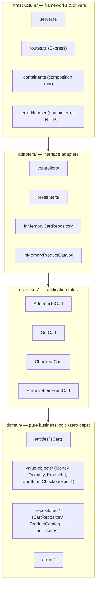
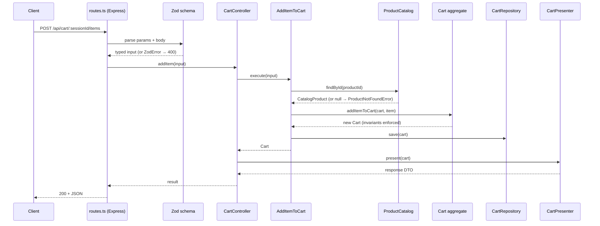

# Architecture

This document describes how the application is structured, the reasoning behind
each layer and pattern, and the trade-offs accepted. It complements
[`domain-model.md`](./domain-model.md), which covers the business model itself.

The guiding rule is **Clean Architecture's dependency rule**: source-code
dependencies point **inward only**. Inner layers know nothing about outer ones.
The domain compiles and is fully testable with no framework, no HTTP, and no I/O.

## Layers



Arrows are *compile-time dependencies*. Everything points toward `domain/`, which
points at nothing. At **runtime**, control flows the other way (HTTP → controller
→ use case → repository), and the inward dependency is preserved because use cases
depend on repository **interfaces** defined in the domain, not on the concrete
implementations in `adapters/` — this is the Dependency Inversion Principle.

| Layer | Responsibility | Knows about |
|-------|----------------|-------------|
| `domain/` | Entities, value objects, invariants, repository **interfaces**, domain errors. | Nothing. |
| `usecases/` | Orchestrate a single application action; load → call domain → save. | `domain/` only. |
| `adapters/` | Translate between the outside world and use cases: controllers (in), presenters (out), repository + catalog implementations. | `usecases/`, `domain/`. |
| `infrastructure/` | Express server, routing, the composition root, error-to-HTTP mapping. | All inner layers — the only layer that imports Express. |

## Ports (interfaces in the domain)

Two ports invert the dependencies on I/O:

```ts
interface CartRepository {
  findBySessionId(sessionId: string): Promise<Cart | null>
  save(cart: Cart): Promise<void>
}

// Plays the "ProductValidator" role from the brief, renamed for honesty:
// it resolves trusted product data rather than merely validating a payload.
interface ProductCatalog {
  findById(productId: ProductId): Promise<CatalogProduct | null>
}
```

`CatalogProduct` carries the authoritative `name` and `unitPrice`. The cart
**snapshots** these at add-time, so later catalog changes never mutate a cart.

### Naming: `ProductCatalog`, not `ProductRepository`

The two ports — and therefore their adapters, `InMemoryCartRepository` and
`InMemoryProductCatalog` — carry deliberately different suffixes. The adapter file
name simply mirrors the port it implements, so the question is really why one port
is a `Repository` and the other a `Catalog`. Three reasons:

- **Different DDD roles.** `CartRepository` is a *Repository* in the DDD sense: it
  owns the lifecycle of an aggregate root (`Cart`), keyed by identity, with both
  read (`findBySessionId`) and write (`save`). `ProductCatalog` is a **read-only
  lookup of reference data** the system does not own or mutate — `findById` only,
  no `save`.
- **The interface shape reflects the role.** Naming the read-only port
  `ProductRepository` would imply a write side and an ownership/lifecycle that does
  not exist. `Catalog` is the precise, well-understood term in an e-commerce domain
  for "a queryable collection of reference products."

  | Port | Methods | Mutates? | Owns aggregate? |
  |------|---------|----------|-----------------|
  | `CartRepository` | `findBySessionId`, `save` | yes | yes (`Cart`) |
  | `ProductCatalog` | `findById` | no | no (reference data) |

- **The convention is still consistent.** The rule is *adapter = `<strategy><PortName>`*
  (`InMemory` + port). The differing suffix is two intentionally different port
  names, not an inconsistency. Renaming `ProductCatalog` → `ProductRepository` for
  cosmetic uniformity was rejected: it would weaken the signal that one port is a
  mutable aggregate store and the other read-only reference data.

> **Why server-side lookup, not client-supplied price.** The client sends only
> `{ productId, quantity }`. Trusting a client-supplied price would let a caller
> set their own prices — a security flaw, not just a modelling one. Resolving
> price server-side is realistic and demonstrates a second port/adapter pair.
> The cost: a small seeded `InMemoryProductCatalog` must exist. Acceptable.

## Dependency injection via factory functions

Each use case is a factory taking its dependencies as arguments and returning
`{ execute }`. The arguments are the injection mechanism — no DI container, no
mocking framework.

```ts
export const createAddItemToCart = (
  carts: CartRepository,
  catalog: ProductCatalog,
): AddItemToCart => ({
  execute: async ({ sessionId, productId, quantity }) => {
    const product = await catalog.findById(productId)
    if (!product) throw new ProductNotFoundError(productId)

    const cart = (await carts.findBySessionId(sessionId)) ?? createCart(sessionId)
    const item = createCartItem(product, quantity)   // VO factories validate
    const updated = addItemToCart(cart, item)         // aggregate enforces invariants
    await carts.save(updated)
    return updated
  },
})
```

The **composition root** (`infrastructure/container.ts`) is the single place that
constructs concrete implementations and wires the graph:

```ts
const carts = createInMemoryCartRepository()
const catalog = createInMemoryProductCatalog(seedProducts)

const useCases = {
  addItem: createAddItemToCart(carts, catalog),
  getCart: createGetCart(carts),
  checkout: createCheckoutCart(carts),
  removeItem: createRemoveItemFromCart(carts),
}

const controller = createCartController(useCases, cartPresenter)
```

Tests inject a real `InMemoryCartRepository` and a stub catalog — no mocks needed.

## Request flow

Controllers stay framework-agnostic: they receive an already-parsed, typed input
object and return a plain result. The Express wiring (reading `req`, writing
`res`, status codes) lives only in `routes.ts` and the error handler. This keeps
even the *adapter* layer free of framework types.



## Use cases

| Use case | Input | Behaviour | Failure |
|----------|-------|-----------|---------|
| `AddItemToCart` | `{ sessionId, productId, quantity }` | Resolve product, lazily create cart if absent, merge/add line, save. | `ProductNotFoundError`, `InvalidQuantityError`, `CurrencyMismatchError` |
| `GetCart` | `{ sessionId }` | Return the cart; if none exists, return a fresh empty cart for that session. | — |
| `CheckoutCart` | `{ sessionId }` | Produce a `CheckoutResult` snapshot from the cart. | `EmptyCartError` |
| `RemoveItemFromCart` | `{ sessionId, productId }` | Remove the line (the route's `:itemId` is the `productId`), save. | `ItemNotFoundError` |

> **`GetCart` returns an empty cart rather than 404.** Carts are session-scoped
> and created lazily, so "no cart yet" and "empty cart" are the same state to a
> caller. This keeps the endpoint idempotent. Trade-off noted: a stricter API
> might 404 an unknown session — rejected here as needless friction.

## Error handling

Domain errors are explicit, named types (never generic `Error`). A single Express
error-handling middleware maps them to status codes, so no inner layer ever
imports an HTTP concept:

| Error | HTTP |
|-------|------|
| Zod validation failure | 400 Bad Request |
| `InvalidQuantityError` | 400 Bad Request |
| `CurrencyMismatchError` | 409 Conflict |
| `ProductNotFoundError` | 404 Not Found |
| `ItemNotFoundError` | 404 Not Found |
| `EmptyCartError` | 409 Conflict |
| anything else | 500 Internal Server Error |

## Validation strategy

Input is validated **at the boundary** with Zod schemas in the route layer,
producing typed objects before any use case runs. The domain re-validates its own
invariants through value-object factories — the two are not redundant: Zod guards
*shape and type* at the edge, the domain guards *business rules* at its core. With
both in place there is no `any` anywhere in the request path.

## Patterns used (and why)

| Pattern | Where | Why |
|---------|-------|-----|
| **Repository** | `CartRepository` port + `InMemoryCartRepository` | Abstracts storage; swapping in a real DB is a pure adapter change. |
| **Ports & Adapters (Hexagonal)** | `CartRepository`, `ProductCatalog` | All I/O is an interface owned by the domain; adapters plug in. |
| **Dependency Injection** | factory args + `container.ts` | Loose coupling, trivially testable, no container/framework magic. |
| **Use Case / Interactor** | `usecases/*` | One application action per file; orchestration lives outside the domain. |
| **Factory Functions** | use cases, repositories, value objects | The functional-composition style the brief prefers; closures hold deps/state. |
| **Value Objects** | `Money`, `Quantity`, `ProductId`, … | Immutability + validation; kill primitive obsession (see domain-model.md). |
| **Presenter** | `adapters/presenters/` | Keeps response shaping out of controllers and out of the domain. |

## Trade-offs summary

- **Async repository over in-memory storage.** Adds `Promise` indirection that an
  in-memory `Map` does not need, but matches a real DB's contract so the seam is
  honest and future-proof.
- **Manual composition root over a DI container.** More wiring by hand, but no
  hidden magic and nothing to learn to read the code.
- **Framework-agnostic controllers.** One extra mapping step in `routes.ts` buys
  a domain *and* adapter layer with zero Express types — the property under test.
- **Single bounded context.** No anti-corruption layer or event bus yet; the
  catalog is treated as an external read via one port. Noted as the natural
  extension point.
