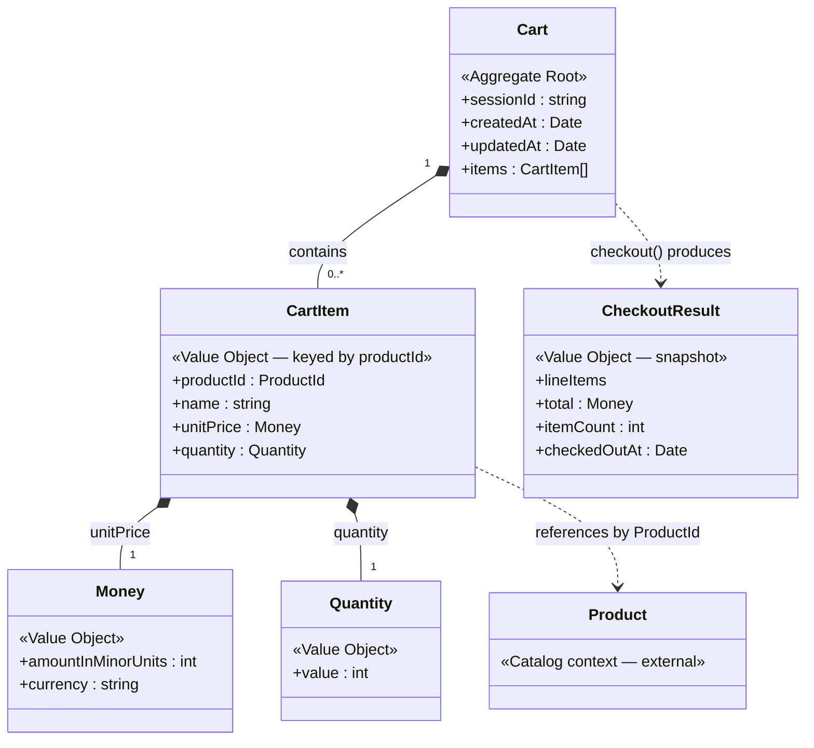

# Domain Model

This document describes the domain model for the shopping cart, the reasoning
behind each decision, and the alternatives that were considered and rejected.
The guiding principle is **model the rules that exist, and no more** — every
type below earns its place by protecting an invariant or removing primitive
obsession.

## Bounded context

The model covers a single **Cart** context. A `Product` belongs to a separate
**Catalog** context owned elsewhere; the cart references products by id and
snapshots the data it needs (name, price) at the moment an item is added.

## Building blocks

### Value Objects

Immutable, equality by value, validated on construction. They cannot exist in an
invalid state.

| Value Object   | Shape                                                        | Why a value object |
|----------------|-------------------------------------------------------------|--------------------|
| `Money`        | `{ amountInMinorUnits: integer, currency: string }`         | Defined entirely by its amount + currency; two `Money` of equal amount/currency are interchangeable. |
| `ProductId`    | non-empty string                                            | Identifies a catalog product; no lifecycle of its own here. |
| `Quantity`     | positive integer                                            | Centralises the "positive integer" rule; kills primitive obsession. |
| `CartItem`     | `{ productId, name, unitPrice: Money, quantity: Quantity }` | A line item with no identity beyond its `productId` (see below). |
| `CheckoutResult` | `{ lineItems, total: Money, itemCount, checkedOutAt }`    | An immutable snapshot returned by checkout; not a persisted aggregate. |

### Entities

| Entity | Identity    | Notes |
|--------|-------------|-------|
| `Cart` | `sessionId` | The single **aggregate root**. Owns its items and enforces all invariants. |

### Repositories (interfaces, defined in the domain)

```ts
interface CartRepository {
  findBySessionId(sessionId: string): Promise<Cart | null>
  save(cart: Cart): Promise<void>
}
```

Implementations (e.g. `InMemoryCartRepository`) live in the adapters layer.

---

## Question-by-question rationale

### What should be an entity vs a value object?

The test is **identity vs. attributes**. `Cart` needs continuity over time and is
referenced by `sessionId`, so it is an **entity**. Everything else is defined
purely by its values and is freely replaceable, so it is a **value object**.

**`CartItem` is modelled as a value object keyed by `productId`.** Because
quantities merge by product, a line item has no meaningful identity beyond the
product it represents. This keeps the model simple (no id generation) and matches
the merge rule directly. A consequence: the API route's `:itemId` **is** the
`productId`.

> **Rejected alternative:** modelling `CartItem` as a *local entity* with its own
> generated `itemId`. That is the textbook DDD choice and would be required if we
> two separate lines for the same product were ever needed (e.g. different gift
> wrapping). No such requirement exists, so adding id generation now would be
> overengineering. The model can be promoted later without touching the rest of
> the system.

### What are the aggregate boundaries?

There is exactly one aggregate: **`Cart`**, containing its `CartItem`s.

- Nothing outside the cart loads or mutates a `CartItem` directly — all changes
  go through the root, which is how invariants stay enforced.
- `Product` is **outside** the boundary. The cart references it by `ProductId`
  and snapshots `name`/`unitPrice`, so later catalog price changes do not
  retroactively alter a cart. This keeps the aggregate small and decoupled from
  the catalog's lifecycle.
- Checkout returns a **`CheckoutResult` value object**, not an `Order` aggregate.

> **Rejected alternative:** a full `Order`/`Payment` aggregate created at
> checkout. Correct in a real system, but out of scope here (no persistence of
> orders, no payment). Noted as a future boundary.

### What business rules / invariants must the Cart protect?

- A `Quantity` is always a **positive integer**.
- **No duplicate product lines** — adding a product already in the cart merges
  into the existing line's quantity rather than creating a second line.
- **Single currency per cart** — adding an item whose currency differs from the
  items already present is rejected. This protects the total calculation.
- Removing an item that is not in the cart raises an explicit `ItemNotFoundError`.
- **Checkout on an empty cart is rejected.**
- **Checkout empties the cart.** A successful checkout produces a
  `CheckoutResult` snapshot and returns the cart to an empty state, ready for
  reuse under the same `sessionId`. The cart carries no `status` field: in this
  scope a checked-out cart is simply an empty one, which keeps the aggregate
  small and avoids a lifecycle state machine with no consumer. (A persisted
  `Order` aggregate with explicit status would be the natural extension — see the
  rejected alternative under *aggregate boundaries*.)

These rules live **inside the `Cart` aggregate** (and the value objects it uses),
not in the use cases — the use cases orchestrate, the domain enforces.

### How do you handle money calculations?

`Money` stores **integer minor units** (e.g. cents), never a floating-point
amount. Floating point makes money a correctness bug (`0.1 + 0.2 !== 0.3`).
`Money` exposes `add`, `multiply(by: Quantity)`, and value equality, and each
binary operation guards that the currencies match (`CurrencyMismatchError`).

> **Deliberate deviation from the brief's example.** `requirements.md` shows a
> `Money` with a `number` `amount` and float multiplication. This model deviates
> on purpose: integer minor units is the correct production choice, and flagging
> the trade-off is more valuable than copying the sample.

**Trade-offs of the integer-minor-units approach.** It is the right default, but
it is not free:

- **No sub-minor-unit precision.** Some domains price below the minor unit (fuel
  at fractional cents, FX rates, per-unit costs that divide out). Integer cents
  cannot represent these without a separate higher-precision type or scaling
  factor.
- **Division and rounding are still hard.** Integers remove *addition/multiplication*
  float error, but splitting a total (discounts, tax, "divide evenly across N
  lines") still requires an explicit rounding policy and remainder handling — the
  problem is moved, not erased.
- **Currency-specific exponents.** "Minor units" is not universally 1/100: JPY has
  0 decimal places, BHD has 3. A single hard-coded ×100 assumption is wrong for
  those; a correct implementation needs per-currency exponent metadata.
- **Overflow ceiling.** JS `number` is exact only up to 2^53−1. Very large
  aggregates (high-volume baskets, micro-priced goods) could in principle exceed
  the safe-integer range, where `bigint` or a decimal library would be needed.
- **Ergonomics at the boundary.** Inputs and outputs are usually decimal
  (`19.99`), so every adapter/presenter must convert to and from minor units,
  adding a small but real translation layer the float model would not need.

For an in-memory cart in a single currency these costs are negligible, which is
why the integer model wins here — but they are the reasons it is not an automatic
choice in every monetary system.

### Should quantities have their own type?

**Yes.** A `Quantity` value object puts the "positive integer" rule in exactly
one place, removes primitive obsession (`number` could be anything), and gives a
natural home for the merge operation (`addQuantity`). It is reused enough to earn
its keep.

> For contrast, the line item's `name` stays a plain `string` — wrapping it in a
> `CartItemName` VO would be ceremony with no invariant to protect. That line —
> "wrap it only when there's a rule to enforce" — is how the model avoids
> overengineering.

### Domain events

**None.** The model raises no domain events. Events earn their place when a state
change must notify *decoupled* consumers — other aggregates, an integration bus,
projections. This API has none of that: it is synchronous, single-process, and
in-memory, and every operation already returns the new `Cart` (or
`CheckoutResult`) directly to its caller. Emitting `ItemAddedToCart` /
`CartCheckedOut` events with no subscriber would be ceremony — the same
"wrap it only when there's a rule to enforce" discipline applied to behaviour.

> **Where they would fit.** In a fuller system, `CartCheckedOut` is the obvious
> first event: published at checkout to hand off to an order/fulfilment context
> (reserve stock, create an `Order`, send a confirmation). That boundary is
> already anticipated by returning a `CheckoutResult` value object rather than
> mutating an `Order` here, so events can be added later without reshaping the
> aggregate.

---

## Domain errors

Explicit, named errors raised by the domain (not generic `Error`):

- `InvalidQuantityError` — raised when a `Quantity` is not a positive integer.
- `InvalidMoneyError` — raised when a `Money` value is invalid (e.g. a negative
  or non-integer minor-unit amount).
- `InvalidProductIdError` — raised when a `ProductId` is not a non-empty string.
- `CurrencyMismatchError`
- `ItemNotFoundError`
- `EmptyCartError`
- `ProductNotFoundError` — raised when a requested `productId` is absent from the
  catalog. Lives at the domain boundary because the cart only admits products the
  catalog vouches for.

These let adapters map domain failures to HTTP status codes without leaking
framework concerns into the domain.

## Aggregate / relationship diagram


