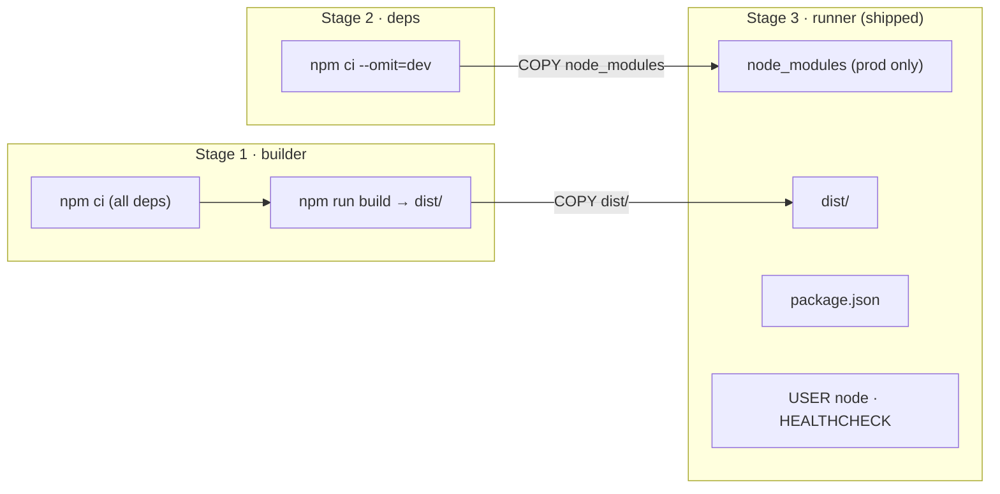

# Docker

This directory holds the container strategy for the shopping cart API. The
guiding idea: **the image is the environment**. Instead of requiring a host to
have the right Node version, npm, and build steps, the image freezes Node 20,
the exact locked dependencies, the compiled `dist/`, the start command, the
port, and a healthcheck into one reproducible artifact. That artifact runs the
same on a Windows laptop, a Linux CI runner, and a production task.

## Three images, three jobs

A single Dockerfile cannot serve development, CI, and production well — they
optimise for opposite goals. Each concern gets its own file.

| File | Goal | Contains | Notable traits |
|------|------|----------|----------------|
| [`dev/Dockerfile`](./dev/Dockerfile) | Fast inner loop | Full deps + `tsx watch` | Source bind-mounted, hot reload, not size-optimised |
| [`prod/Dockerfile`](./prod/Dockerfile) | Small, safe to ship | Only `dist/` + production deps | Multi-stage, non-root, alpine, healthcheck |
| [`ci/Dockerfile`](./ci/Dockerfile) | Reproducible checks | Full toolchain (vitest/eslint/tsc) | Pinned environment for the verification gate |

The production image is the **deployable artifact** — the unit the CD pipeline
builds, pushes, and deploys to the Terraform-defined infrastructure. The dev
image and `docker-compose.yml` are for **local development only** and are never
the deployment mechanism.

## Production image: multi-stage build

The production Dockerfile uses three stages so the final runtime image contains
neither the TypeScript compiler nor any dev/test dependency. Only compiled
output and production `node_modules` survive into the shipped layer.



Why this shape:

- **Multi-stage** — the compiler and dev dependencies exist only in build stages
  and are discarded. The runtime layer carries no toolchain it does not need to
  run, which shrinks both size and attack surface.
- **Separate `deps` stage** — production dependencies are resolved with
  `npm ci --omit=dev` in isolation, guaranteeing the runtime image can never
  pick up a dev dependency by accident.
- **Non-root** — `node:alpine` ships an unprivileged `node` user (uid 1000). All
  files are `--chown`ed to it and the container runs as `USER node`, so a
  compromised process never holds root inside the container.
- **Alpine base** — minimal musl-based image. Distroless was considered (no
  shell, marginally smaller attack surface) but alpine was chosen for
  debuggability: `docker exec ... sh` works when something needs inspecting.
- **Built-in healthcheck** — uses Node 20's native `fetch` against `/health`, so
  no `curl`/`wget` needs to be installed. Orchestrators (Compose, ECS) read this
  to gate traffic until the app is actually ready.
- **Layer caching** — manifests (`package.json`, `package-lock.json`) are copied
  and installed before application source, so dependency layers are reused
  across builds whenever only source changes.

### Image size — three numbers, and which one the target means

Three commands report three different sizes for this image. All are "correct";
they measure different things, so it is worth being explicit about which one the
`<100 MB` target refers to.

| Command | Measures | Value |
|---------|----------|-------|
| `docker image inspect cart-api:prod --format '{{.Size}}'` | **Compressed** content — the bytes a registry stores and a task pulls (single platform) | **~47 MB** |
| `docker history` (sum of layers) | **Uncompressed** on-disk footprint (single platform) | ~155 MB |
| `docker images` | `docker history` total **plus** the rest of the manifest list — multi-arch variants and the provenance/SBOM attestations buildx attaches by default | ~205 MB |

The number that governs how fast a task starts and what the registry bills is the
**compressed pull size: ~47 MB, comfortably under the 100 MB target.** (A
`node:20-alpine`-based image cannot be 47 MB *uncompressed* — the Node runtime
alone is ~130 MB on disk; 47 MB is the compressed figure `docker image inspect`
reports under Docker Desktop's containerd image store.)

The uncompressed weight is dominated by the Node runtime in the base, not by this
application. From `docker history`:

| Layer | Uncompressed |
|-------|--------------|
| `node:20-alpine` (Node 20 runtime + npm + alpine rootfs) | ~145 MB |
| production `node_modules` (express + zod) | 9.83 MB |
| `dist/` (compiled app) | 352 kB |
| `package.json` | 12 kB |

The application adds only ~10 MB on top of the base. Everything the multi-stage
build can strip is stripped — no compiler, no dev/test dependencies, no source.
What remains is the Node runtime, the floor for any `node:alpine` image.

> **Measuring it.** Use `docker image inspect` for the registry/pull size and
> `docker history` to see where the uncompressed bytes go:
>
> ```bash
> docker image inspect cart-api:prod --format '{{.Size}}'   # compressed, 1 platform
> docker history cart-api:prod --human                      # uncompressed, per layer
> ```
>
> Do **not** use the `docker images` column for a target comparison: on Docker
> Desktop's containerd store it sums the whole manifest list (arch variants +
> attestations), which is not what any single task pulls.
>
> When CD builds for deployment it should pin one platform and skip attestations
> so the pushed artifact is exactly the lean single-platform image:
>
> ```bash
> docker buildx build --platform linux/amd64 --provenance=false \
>   -f infra/docker/prod/Dockerfile -t <registry>/cart-api:<tag> .
> ```

The *uncompressed* footprint cannot realistically be pushed under 100 MB by
swapping the base — the stock Node runtime binary (~90–130 MB on disk) is the
floor. This was verified, not assumed: a distroless POC
(`gcr.io/distroless/nodejs20`) was built and measured. It trimmed uncompressed
from ~155 MB to ~136 MB and the compressed pull from ~47 MB to ~46 MB, but stayed
**over 100 MB uncompressed** while losing the shell needed to `docker exec ... sh`
and debug. `node:20-slim` is *larger* still — Debian/glibc userland outweighs
alpine's musl + busybox. Alpine is therefore the smallest practical full-Node
base, and the compressed pull size already meets the target. Beating the runtime
floor would mean abandoning the stock Node runtime entirely (a single-binary
build via Bun/Deno or Node SEA), which is out of scope here. See
[Trade-offs](#trade-offs).

## Optimization strategy

Every technique below is applied in the production build. They split into two
goals — making the shipped image **small and safe**, and making builds **fast and
cache-friendly**.

### Smaller, safer image

| Lever | Mechanism | Payoff |
|-------|-----------|--------|
| **Multi-stage build** | `builder` and `deps` stages do the heavy work; only `runner` is shipped | The TypeScript compiler, dev/test deps, and source never reach the runtime image — smaller size *and* smaller attack surface |
| **Dedicated prod-deps stage** | `npm ci --omit=dev` resolved in isolation in the `deps` stage | The runtime `node_modules` can never accidentally include a dev dependency |
| **Copy only three artifacts** | `runner` pulls in just `node_modules`, `dist/`, and `package.json` | Nothing extraneous (no `src/`, configs, tests, `.git`) is in the final layers |
| **Alpine base** | `node:20-alpine` (musl + busybox) | Smallest practical full-Node base; ~145 MB vs ~1 GB for the full `node` image |
| **`npm cache clean --force`** | Run in the `deps` stage after install | Drops npm's download cache from that layer before it is copied forward |
| **Non-root runtime** | `--chown=node:node` on COPY + `USER node` | Drops privileges in-image; the chown happens *during* COPY, avoiding an extra layer |
| **`.dockerignore`** | Excludes `node_modules`, `dist`, `coverage`, `.git`, docs, infra | Keeps the build context tiny so host artifacts can't leak into a layer |
| **Single-platform CD build** | `--platform linux/amd64 --provenance=false` (CD only) | Pushes exactly the lean artifact — no multi-arch variants or attestation manifests inflating the pushed size |

### Faster, cache-friendly builds

| Lever | Mechanism | Payoff |
|-------|-----------|--------|
| **Layer ordering** | `COPY package*.json` + install **before** `COPY src` | The dependency layer is reused on every build where only source changed — the expensive `npm ci` is skipped |
| **`npm ci` + committed lockfile** | Deterministic install from `package-lock.json` | Reproducible, and the layer's cache key is stable unless the lockfile changes |
| **BuildKit registry cache (CI/CD)** | `cache-from` / `cache-to` against a `buildcache` tag | Layers are reused *across* CI runners and machines, not just locally |
| **Stage parallelism** | `builder` and `deps` have no dependency on each other | BuildKit builds them concurrently |

The net effect: a clean build produces a ~47 MB (compressed) non-root image, and a
source-only change rebuilds in seconds because the dependency layers stay cached.

## Local development with Compose

[`../docker-compose.yml`](../docker-compose.yml) builds the dev image and
bind-mounts `./src` so source edits on the host are visible inside the container,
running against the same Node 20 Linux runtime production uses.

`node_modules` is intentionally **not** mounted from the host; the container
keeps the Linux-built modules from its own image, avoiding host/OS mismatches
(e.g. modules built on Windows).

### Hot reload and the recommended dev loop

The container runs `tsx watch`, which reloads on filesystem change **events**.
Those events fire reliably on native Linux and when the repo lives on the WSL2
filesystem. They do **not** propagate across a Docker Desktop bind mount when the
repo sits on the Windows filesystem (`C:\...`): the file contents reach the
container, but the change event does not, so `tsx` never restarts. macOS goes
through the same Docker Desktop VM and has not been tested here, so in-container
hot reload should not be assumed there either. `tsx` depends only on esbuild (no
chokidar), so it has no polling fallback to force.

Therefore the recommended fast inner loop on Windows is to run the watcher **on
the host**, where reload is instant:

```bash
npm run dev      # tsx watch on the host — instant hot reload
```

The Docker dev image and Compose service exist for **environment parity and
onboarding** — a one-command way to boot the app in the exact Linux runtime,
verify it starts, and exercise the API — not as the moment-to-moment edit loop.
Treat an in-container source edit as requiring a restart (`docker compose
restart api`) rather than expecting automatic reload.

### Running it

`docker compose` discovers its config in the **current directory**. The compose
file lives in `infra/`, so running `docker compose up` from the repo root fails
with `no configuration file provided: not found`. Use one of:

```bash
# From the infra/ directory
cd infra && docker compose up --build

# Or point at the file explicitly from anywhere (-f precedes the subcommand)
docker compose -f infra/docker-compose.yml up --build
```

The API is then on http://localhost:3000 (`GET /health` for a readiness check).
Stop with `docker compose down`.

## Build context and `.dockerignore`

All image builds use the **repo root** as the build context (Compose sets
`context: ..`). The root [`.dockerignore`](../../.dockerignore) keeps that
context small and deterministic — it excludes anything the image builds itself
(`node_modules`, `dist`, `coverage`) and everything irrelevant at build time
(`.git`, docs, infra, logs). This speeds builds, avoids busting the layer cache
on unrelated changes, and prevents stale host artifacts from leaking into a
layer.

## Command reference

```bash
# Production image — build, inspect true size, run
docker build -f infra/docker/prod/Dockerfile -t cart-api:prod .
docker image inspect cart-api:prod --format '{{.Size}}'
docker run --rm -p 3000:3000 cart-api:prod

# CI image — run the suite in the pinned environment (override CMD per job)
docker build -f infra/docker/ci/Dockerfile -t cart-api:ci .
docker run --rm cart-api:ci npm run lint
docker run --rm cart-api:ci npm run typecheck
docker run --rm cart-api:ci npm run test:coverage

# Local dev — boots the app in the Linux runtime (env parity, not hot reload on
# Windows; use `npm run dev` on the host for the fast edit loop)
docker compose -f infra/docker-compose.yml up --build
```

## Trade-offs

- **Three Dockerfiles over one parameterised file.** More files to maintain, but
  each is small and single-purpose; build-arg branching inside one file would be
  harder to read and easier to misconfigure.
- **Alpine over distroless.** A distroless runtime was built and measured (see
  [Image size](#image-size--three-numbers-and-which-one-the-target-means)): it
  saved only ~1 MB compressed / ~19 MB uncompressed and *still* exceeded 100 MB
  uncompressed, while removing the shell needed to `docker exec ... sh` and debug.
  Alpine's slightly larger attack surface buys real debuggability for no
  meaningful size gain. Distroless remains a drop-in swap for the runtime stage if
  a stricter posture is later wanted.
- **Async/HTTP healthcheck in-image.** Adds a tiny periodic Node invocation, but
  gives orchestrators an honest readiness signal without extra binaries.
