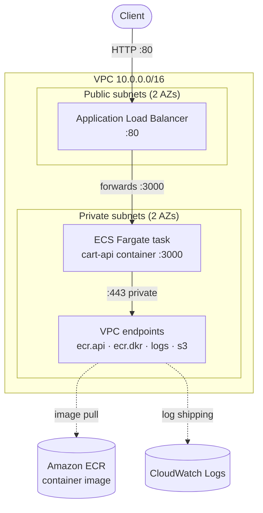
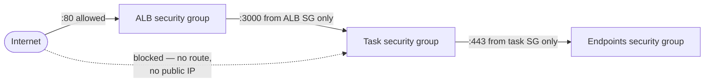
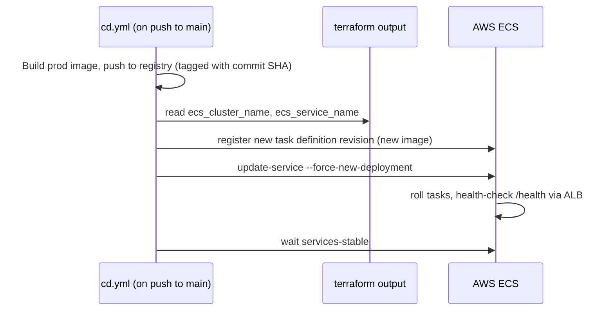

# Infrastructure (Terraform)

Infrastructure-as-Code for deploying the shopping cart API to **AWS ECS Fargate**.

> ### ⚠️ Knowledge demonstration only — never applied
>
> These `.tf` files describe the infrastructure in code; they are **not** used to
> provision anything. No `terraform apply` runs in any pipeline, there are no AWS
> credentials in the repo, and state is local. This matches the assessment brief:
> *"Actual provisioning/deployment is not required — we want to see that you
> understand infrastructure concepts and can express them in code."*

---

## What gets deployed

A single containerised REST API, fronted by a load balancer, running on
serverless containers in a network that keeps the application **fully private** —
it has no inbound internet exposure and no outbound internet access at all.



**Request path:** the client only ever reaches the load balancer. The ALB, in the
public subnets, forwards to the container in the private subnets. The container
has no public IP and no internet route — it pulls its image and ships its logs
over **VPC endpoints**, so that traffic never leaves AWS's network.

---

## Files and what each one does

| File | Responsibility |
| --- | --- |
| `main.tf` | Terraform settings + AWS provider (region, default tags). Documents the would-be S3 state backend. |
| `variables.tf` | All tunable inputs (region, image tag, CPU/memory, counts) with defaults. |
| `vpc.tf` | The network: VPC, 2 public + 2 private subnets across 2 AZs, internet gateway, public + private route tables. |
| `security.tf` | The ALB and task security groups — the firewall rules controlling who can talk to what. |
| `iam.tf` | The task **execution role** and the (empty) **task role** — least-privilege identities. |
| `ecr.tf` | The private container registry the task pulls from (immutable tags, scan-on-push). |
| `endpoints.tf` | VPC endpoints (ecr.api, ecr.dkr, logs, s3) so private tasks reach AWS with no internet. |
| `alb.tf` | Application Load Balancer, target group (with `/health` check), and the :80 listener. |
| `ecs.tf` | The compute: ECS cluster, CloudWatch log group, task definition, and the service. |
| `outputs.tf` | Cluster name + service name (consumed by CD), ECR repo URL, and the public ALB DNS name. |

---

## Cloud services used, and why

| Service | Role in this design |
| --- | --- |
| **VPC + subnets** | A private, isolated network. The public/private split is the core security boundary. |
| **Internet Gateway** | The public subnets' route to the internet, so the ALB is reachable. |
| **Application Load Balancer** | The single public entry point. Terminates client connections, health-checks tasks, forwards traffic. Lets the app stay private and scale to multiple tasks. |
| **ECS Fargate** | Runs the container without managing servers. AWS provisions the compute; the service keeps the desired number of copies healthy. |
| **Amazon ECR** | Private image registry. Lets the task pull its image over the private network (via VPC endpoints) rather than the public internet. |
| **VPC endpoints** | Expose ECR, CloudWatch Logs, and S3 *inside* the VPC, so private tasks reach them with zero internet egress. |
| **IAM roles** | Scoped permissions — one for the platform to start the task, one (empty) for the app itself. |
| **CloudWatch Logs** | Destination for the container's stdout/stderr, with capped retention. |

ECS Fargate was chosen over Lambda (the app is a long-running HTTP server, not a
short event handler) and over raw EC2 (no desire to patch/manage servers).

---

## Security design

The brief asks specifically how the backend is protected from the internet. The
posture here is **fully private compute with no internet egress** — four layers:

1. **Network segmentation.** The application task runs in **private subnets** with
   `assign_public_ip = false`. No public IP, no inbound internet route — it is
   unreachable from the internet by construction.
2. **Security groups (least-privilege firewalls).**
   - ALB security group: accepts `:80` from anywhere (it is meant to be public).
   - Task security group: accepts the app port **only from the ALB's security
     group** (referenced by group, not IP). Nothing else can open a connection.
   - Endpoints security group: accepts `:443` **only from the task security
     group**, so only the app can use the VPC endpoints.
3. **No outbound internet access.** The private route table has no internet route.
   The task reaches the only AWS services it needs — ECR (image pull) and
   CloudWatch (logs) — through **VPC endpoints**, entirely within AWS's network.
   Nothing the app does can leak to or be exfiltrated over the public internet.
4. **Least-privilege IAM (two roles).** The **execution role** carries only AWS's
   managed `AmazonECSTaskExecutionRolePolicy` (pull image, write logs). The
   **task role** — the identity the application code runs as — has **no policies
   at all**, because the app calls no AWS services.



---

## Private egress: how a no-internet task still pulls its image

A common pitfall the brief calls out is *"service in the wrong place can't access
resources."* A Fargate task in a private subnet with no NAT gateway normally
**can't pull its image** — it has no path to a registry. This design solves that
without ever opening internet access:

- The image lives in **Amazon ECR** (`ecr.tf`), not a public registry.
- Four **VPC endpoints** (`endpoints.tf`) expose the needed AWS services inside the
  VPC:
  - `ecr.api` + `ecr.dkr` (interface) — authenticate and pull the image,
  - `logs` (interface) — ship container logs to CloudWatch,
  - `s3` (gateway) — fetch the actual image layers (ECR stores them in S3).
- `private_dns_enabled` makes the normal AWS service DNS names resolve to the
  endpoints' private IPs, so the ECS agent needs no special configuration.

The result is the most secure of the standard options: the task pulls images and
logs over AWS's private backbone, and a NAT gateway (with its general internet
egress and ~US$32/month cost) is never needed.

---

## How the CD pipeline deploys to this infrastructure

`../../.github/workflows/cd.yml` connects to this code through the Terraform
outputs — the single source of truth, so names are never hard-coded:



The real `aws ecs` commands are present in `cd.yml` but **commented out** (no live
infrastructure to target). The deploy job instead echoes this plan so the run is
green and the flow is visible in the Actions log.

**Registry note (demo vs production target).** The runnable CD pipeline pushes the
image to **GHCR**, because that needs no AWS credentials and works out-of-the-box
in public GitHub Actions — ideal for this assessment. The Terraform models the
**production target**, where the image lives in **ECR** so it can be pulled
privately via the VPC endpoints. The production cut-over is a small, documented CD
change — kept ready as a commented **PRODUCTION VARIANT** in the `build-and-push`
job of `cd.yml`. It builds the image **once and pushes it straight to ECR** (OIDC
auth → `aws-actions/amazon-ecr-login` → `docker/build-push-action` tagged to the
ECR registry); it does **not** push to GHCR and copy the image into ECR afterwards.
The `deploy` job then only registers a new task-definition revision and rolls it
out — it no longer pushes anything, because the image is already in ECR.

**Why `aws ecs update-service` and not `terraform apply` in CD:** Terraform
provisions the *infrastructure* once (network, cluster, service, roles); shipping
new application code should not re-run infrastructure. Keeping deploys on the
`aws ecs` path cleanly separates "change the infrastructure" from "ship a new
image" and avoids a code release accidentally altering networking.

---

## Trade-offs and what a production version would add

Kept deliberately lean (the brief: *"infrastructure is intentionally simplified —
focus on architecture"*). Conscious omissions, not oversights:

| Omitted | Why | Production would add |
| --- | --- | --- |
| HTTPS / TLS | No domain or certificate in a demo | ACM cert, `:443` listener, `:80 → :443` redirect |
| Autoscaling | Single task is enough to demonstrate the design | Application Auto Scaling target tracking on CPU |
| Remote state (S3 + DynamoDB lock) | Nothing is applied, so no shared state to protect | The `backend "s3"` block sketched in `main.tf` |
| Terraform modules | Flat files are clearer to read for this scope | Reusable `network` / `service` modules per environment |
| WAF, custom domain, multi-region | Beyond the assessment's scope | AWS WAF on the ALB, Route 53 record, multi-region failover |

> Note on the endpoints: interface VPC endpoints carry a small hourly + per-GB cost
> each. They are kept because they are the *secure* answer to the egress problem;
> the cheaper-but-less-secure alternative (a NAT gateway) is deliberately not used.

---

## Validating locally (safe — never contacts AWS)

These commands only parse and type-check the files. None of them reach AWS or
create anything:

```bash
terraform fmt -check    # formatting only
terraform init          # downloads the AWS provider plugin (no AWS calls, no creds)
terraform validate      # type-checks resources, references, and argument shapes
```

`terraform plan` and `terraform apply` are **not** part of this assessment — they
would require AWS credentials and would attempt to contact / create real
infrastructure.
